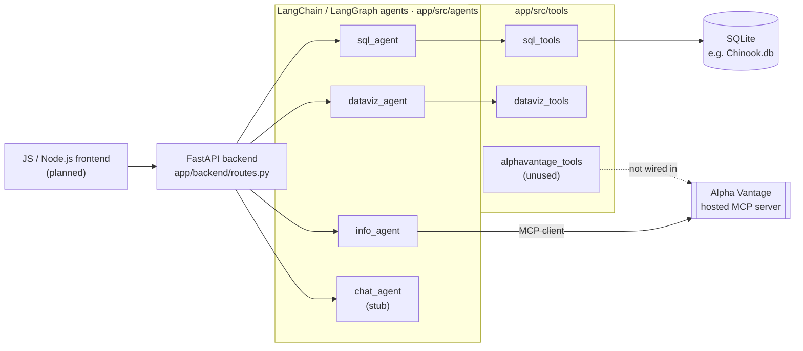

# MCP Agentic Financial Analyst

This project is an agentic analytics application that can:

- interpret user queries in natural language,
- query SQL data sources (SQLite, e.g. the Chinook database),
- pull live market data from external providers (Alpha Vantage) via MCP,
- generate data visualizations (Plotly charts),
- orchestrate the above through LangChain/LangGraph agents,
- expose the tools over an MCP server and a FastAPI backend.

## Tech stack

**Agents & orchestration**


**Backend & protocol**


**Data & visualization**


**Frontend** (planned)


The frontend has not been built yet; a JavaScript/Node.js app is the planned client for the FastAPI backend.

## Architecture



`sql_agent` and `dataviz_agent` are runnable today; `info_agent` talks to Alpha Vantage's hosted MCP server directly. `chat_agent` and the FastAPI/frontend layers are still scaffolding — see [Notes](#notes).

## Data

### Alpha Vantage (market data)

Live market data (quotes, time series, company fundamentals, symbol search) is sourced from [Alpha Vantage](https://www.alphavantage.co/). Two integration paths exist:

- **Hosted MCP server** — [`info_agent.py`](app/src/agents/info_agent.py) connects as an MCP client to Alpha Vantage's hosted MCP server (`https://mcp.alphavantage.co/mcp`), giving the agent Alpha Vantage's full tool catalog without a local wrapper. This is the path currently wired into an agent.
- **Local REST wrapper** — [`alphavantage_tools.py`](app/src/tools/alphavantage_tools.py) calls the Alpha Vantage REST API directly (`get_stock_quote`, `get_daily_time_series`, `get_company_overview`, `search_symbol`) for graphs that shouldn't depend on the hosted MCP server. It isn't wired into an agent yet.

**Setup**

1. Get a free API key: https://www.alphavantage.co/support/#api-key (the free tier is rate-limited; the placeholder `demo` key works for limited testing).
2. Set `ALPHA_VANTAGE_API_KEY` in `.env`.

## Getting started

1. Create a virtual environment (or use `uv`, since this repo is `uv`-managed):
   ```bash
   uv sync
   ```
   or with pip:
   ```bash
   pip install -e .
   ```
2. Copy the environment template and fill in your own values (model id, API keys, path to the SQLite database, etc.):
   ```bash
   cp .example.env .env
   ```
3. Run an agent directly, e.g.:
   ```bash
   python -m app.src.agents.sql_agent
   python -m app.src.agents.dataviz_agent
   python -m app.src.agents.info_agent
   ```
4. Run the test suite:
   ```bash
   pytest
   ```

The FastAPI backend (`app/backend/routes.py`) and MCP server (`app/src/mcp/server.py`) are still early scaffolding and not yet wired to the agents above.

## Notes

This repository is under active development. Several tools and the chat agent are still stubs — replace the placeholder logic with real implementations and orchestration flow as they mature.
